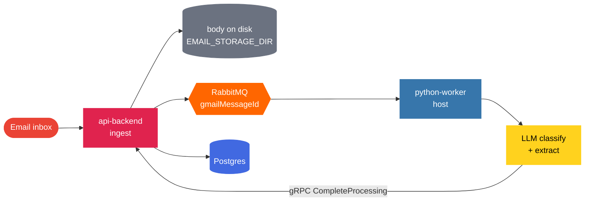

<div align="center">

# Coinmaester

**AI-powered personal finance tracking from transaction emails.**

Sync your inbox, let a local AI model classify messages and extract amounts and merchants, then explore spending in a web UI — all on your machine.

<br />


<br />

[](https://mail.google.com/mail/?view=cm&fs=1&tf=1&to=aniket.chanana%40gmail.com&su=Coinmaester%20-%20interested%20in%20supporting%20or%20collaborating&body=Hi%20Aniket%2C%0A%0AI%20came%20across%20Coinmaester%20and%20really%20like%20what%20you%27ve%20built.%20I%27d%20like%20to%20connect%20and%20explore%20ways%20to%20support%20the%20project%20-%20whether%20that%27s%20funding%2C%20collaboration%2C%20or%20helping%20with%20hosting%20so%20a%20shared%20online%20option%20could%20become%20viable%20someday.%0A%0ALooking%20forward%20to%20hearing%20from%20you.%0A%0ABest%20regards)
[](https://github.com/aniketchanana)
[](https://www.linkedin.com/in/aniket-chanana-470471147/)
[](https://wa.me/919588195330?text=Hi%20Aniket%2C%20I%20came%20across%20Coinmaester%20and%20really%20like%20what%20you%27ve%20built.%20I%27d%20like%20to%20connect%20and%20explore%20ways%20to%20support%20the%20project%20%E2%80%94%20funding%2C%20collaboration%2C%20or%20helping%20with%20hosting.%20Looking%20forward%20to%20hearing%20from%20you.)
[](https://aniketchanana.com)

<p align="center">
  Built independently by <a href="https://aniketchanana.com"><strong>Aniket Chanana</strong></a>
</p>

</div>

This is a **pnpm + Turborepo** monorepo: Next.js web app, NestJS API, and a Python worker that runs the AI model **on the host** (not in Docker).

## Why self-hosted (and not a free online app)?

Coinmaester is intentionally local-first:

1. **Privacy** — Transaction emails are sensitive. AI classification runs on your machine so you keep control of that data instead of sending finance mail to a third-party cloud for inference.
2. **Sustainable open source** — An always-on hosted stack (API, database, queue, and especially AI inference) has real infrastructure cost. Rather than gate the product behind a paid SaaS, the project ships as open source you can self-host today.

If you'd like to **collaborate**, contribute ideas, or help make a future hosted option sustainable, reach out via the [Sponsor](https://mail.google.com/mail/?view=cm&fs=1&tf=1&to=aniket.chanana%40gmail.com&su=Coinmaester%20-%20interested%20in%20supporting%20or%20collaborating&body=Hi%20Aniket%2C%0A%0AI%20came%20across%20Coinmaester%20and%20really%20like%20what%20you%27ve%20built.%20I%27d%20like%20to%20connect%20and%20explore%20ways%20to%20support%20the%20project%20-%20whether%20that%27s%20funding%2C%20collaboration%2C%20or%20helping%20with%20hosting%20so%20a%20shared%20online%20option%20could%20become%20viable%20someday.%0A%0ALooking%20forward%20to%20hearing%20from%20you.%0A%0ABest%20regards) button — a short email is enough to start the conversation.

## Documentation

Pick a guide based on what you're trying to do:

| Guide | Open this when you want to… |
| ----- | --------------------------- |
| [](docs/architecture.md) | Understand the email → LLM → Postgres pipeline, host worker vs Docker, apps and packages |
| [](docs/self-hosting.md) | Run the product for yourself: Docker web/API + host LLM worker, OAuth URIs, networking |
| [](docs/development.md) | Set up a fork for day-to-day coding (`pnpm docker:dev` + `pnpm dev`), ports, conventions |
| [](CONTRIBUTING.md) | Learn PR workflow, coding conventions, and what to run before opening a PR |

## Architecture



> [!IMPORTANT]
> The Python worker never writes to Postgres directly. All persistence goes through gRPC to the API. See [Architecture](docs/architecture.md) for the full pipeline and storage/auth details.

## Tech stack

| Layer | Path | Stack |
| ----- | ---- | ----- |
| **Web** | `apps/web` | Next.js 16, React 19, React Query, Tailwind v4 |
| **API** | `apps/api-backend` | NestJS 11 — REST (`:3001`) + gRPC (`:50051`) |
| **Worker** | `apps/python-worker` | Python 3.14, uv, RabbitMQ consumer, Hugging Face LLM (in-process) |
| **Database** | `packages/database` | Prisma 7, PostgreSQL 16 |
| **Contracts** | `packages/proto` | gRPC `.proto` definitions shared by API and worker |
| **UI kit** | `packages/ui` | shadcn-style Radix components |
| **Infra** | Docker Compose | Postgres + RabbitMQ (always); web + API optional via `docker:prod` |

## Prerequisites

Install these before running the app:

| Requirement | Version / notes | Why |
| ----------- | --------------- | --- |
| **Node.js** | 18+ | Runs the monorepo (web + API via pnpm/Turborepo) |
| **pnpm** | 9 ([install](https://pnpm.io/installation)) | Only supported package manager |
| **Docker** | With Compose ([install](https://docs.docker.com/get-docker/)) | Postgres 16 + RabbitMQ (`docker:dev`); also web + API for `docker:prod` |
| **Python** | 3.14+ | Runtime for `apps/python-worker` |
| **uv** | Latest ([install](https://docs.astral.sh/uv/)) | Installs and runs the Python worker deps |
| **Google Cloud OAuth client** | [Console](https://console.cloud.google.com/) | Sign-in + email inbox access |

> [!NOTE]
> First worker start downloads Hugging Face model weights (default `microsoft/Phi-4-mini-instruct`) — needs disk space and a capable CPU (or GPU if you set `HF_DEVICE`). The LLM worker always runs on the **host**, not inside Docker.

> [!TIP]
> Generate auth secrets with `openssl rand -base64 32` for `AUTH_SECRET` and `TOKEN_ENCRYPTION_KEY` in `.env`.

## Use it yourself (self-host)

Run web + API in Docker; run the LLM worker on the host.

```bash
cp .env.example .env   # set Google OAuth + secrets
pnpm docker:prod       # Postgres, RabbitMQ, api-backend, web
pnpm install
cd apps/python-worker && uv sync && cd ../..
pnpm worker            # required for email classification
```

Full steps, OAuth URIs, and ports: [Self-hosting](docs/self-hosting.md)

## Develop / contribute

```bash
pnpm install
pnpm docker:dev        # Postgres + RabbitMQ only
cp .env.example .env   # configure OAuth + secrets
pnpm db:migrate
cd apps/python-worker && uv sync && cd ../..
pnpm dev               # web, API, worker via Turborepo
```

- Day-to-day setup and ports: [Local development](docs/development.md)
- PR workflow and conventions: [Contributing](CONTRIBUTING.md)

## Scripts cheat sheet

| Command | What it does |
| ------- | ------------ |
| `pnpm docker:dev` | Start Postgres + RabbitMQ |
| `pnpm docker:prod` | Build/start web + API + infra in Docker (prints how to start the worker) |
| `pnpm docker:down` | Stop Compose services |
| `pnpm dev` | Start all apps (web, API, worker) locally |
| `pnpm worker` | Start only the Python LLM worker |
| `pnpm db:migrate` | Run Prisma migrations |
| `pnpm proto:generate` | Regenerate gRPC Python stubs |

## Service URLs (local)

| Service | URL |
| ------- | --- |
| Web | http://localhost:3000 |
| API (direct) | http://localhost:3001 |
| API (via web proxy, Docker prod) | http://localhost:3000/api |
| gRPC | `localhost:50051` |
| RabbitMQ management | http://localhost:15672 (`finance` / `finance`) |

## Environment

Single root `.env` is shared by all apps. Copy from [`.env.example`](.env.example).

For `docker:prod`, container networking overrides live in [`compose.env`](compose.env) (Docker DNS hostnames for Postgres, RabbitMQ, and gRPC). The host-run worker keeps using localhost values from `.env`.

Email bodies are stored under `EMAIL_STORAGE_DIR` (default `./ingested-emails/`). That directory is bind-mounted into the API container so the host worker and containerized API share the same files.

## Support & collaborate

Coinmaester is built and maintained by [Aniket Chanana](https://aniketchanana.com) ([@aniketchanana](https://github.com/aniketchanana)).

If the project helps you — and you want to fund development, partner on features, or help underwrite hosting for a shared online option someday — reach out on any channel below:

| Channel | Link |
| ------- | ---- |
| **Email** (prefilled) | [aniket.chanana@gmail.com](https://mail.google.com/mail/?view=cm&fs=1&tf=1&to=aniket.chanana%40gmail.com&su=Coinmaester%20-%20interested%20in%20supporting%20or%20collaborating&body=Hi%20Aniket%2C%0A%0AI%20came%20across%20Coinmaester%20and%20really%20like%20what%20you%27ve%20built.%20I%27d%20like%20to%20connect%20and%20explore%20ways%20to%20support%20the%20project%20-%20whether%20that%27s%20funding%2C%20collaboration%2C%20or%20helping%20with%20hosting%20so%20a%20shared%20online%20option%20could%20become%20viable%20someday.%0A%0ALooking%20forward%20to%20hearing%20from%20you.%0A%0ABest%20regards) |
| **LinkedIn** | [aniket-chanana-470471147](https://www.linkedin.com/in/aniket-chanana-470471147/) |
| **WhatsApp** (prefilled) | [+91-9588195330](https://wa.me/919588195330?text=Hi%20Aniket%2C%20I%20came%20across%20Coinmaester%20and%20really%20like%20what%20you%27ve%20built.%20I%27d%20like%20to%20connect%20and%20explore%20ways%20to%20support%20the%20project%20%E2%80%94%20funding%2C%20collaboration%2C%20or%20helping%20with%20hosting.%20Looking%20forward%20to%20hearing%20from%20you.) |
| **GitHub** | [@aniketchanana](https://github.com/aniketchanana) |
| **Website** | [aniketchanana.com](https://aniketchanana.com) |
